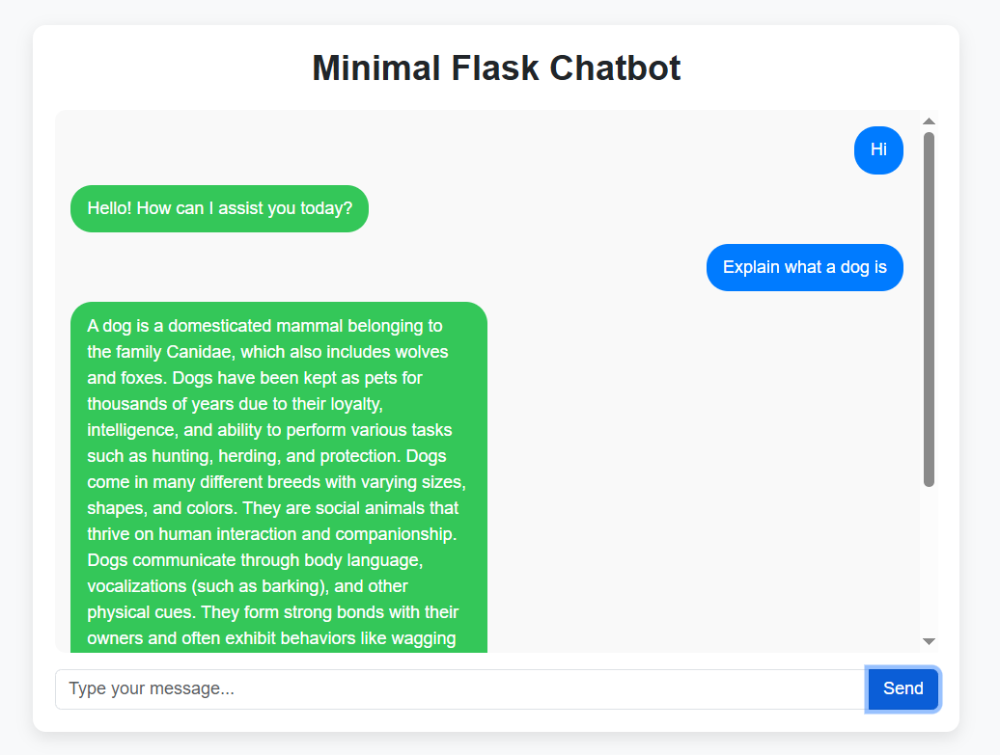

# MINIMAL FLASK CHATBOT




This is a simple chatbot built using Flask and Hugging Face Transformers, designed for a minimal and clean user experience. The chatbot responds to user messages and can be easily deployed locally.

## FEATURES

- Simple UI with a chat interface
- Uses Hugging Face Transformers for generating responses
- Built with Flask as the backend framework
- Minimalistic design for easy interaction
- Lightweight and easy to run locally

## INSTALLATION

### 1. Clone the repository
```bash
git clone https://github.com/aleexc12/minimal-flask-chatbot.git
cd minimal-flask-chatbot
```

### 2. Create a virtual environment (optional, but recommended)
```bash
python -m venv venv
source venv/bin/activate   # For Linux/macOS
venv\Scripts\activate      # For Windows
```

### 3. Install dependencies
```bash
pip install -r requirements.txt
```

## USAGE

### Run the chatbot
```bash
python server.py
```
The server will start, and you can access the chatbot in your browser at:
```
http://127.0.0.1:5000
```

## PROJECT STRUCTURE

```
/minimal-flask-chatbot
│── imgs/
│   └── image.png         # Screenshot of the chatbot UI
│── templates/
│   └── index.html        # Frontend (HTML UI)
│── server.py             # Main Flask backend
│── requirements.txt      # Dependencies
│── README.md             # Project documentation
```

## CONTRIBUTING

Feel free to fork this repository and improve the project. Contributions are welcome!

## LICENSE

This project is licensed under the MIT License.